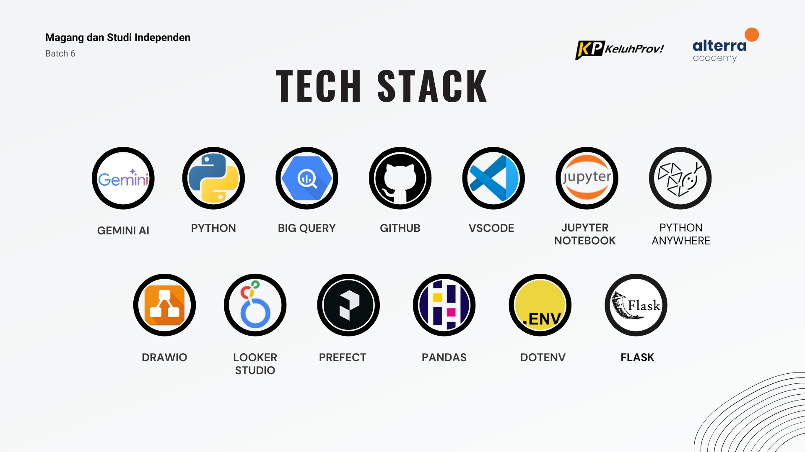
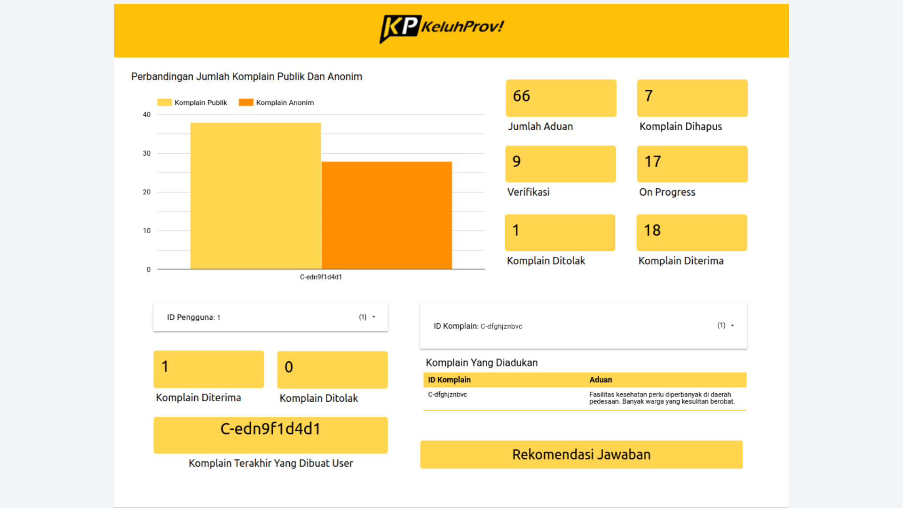
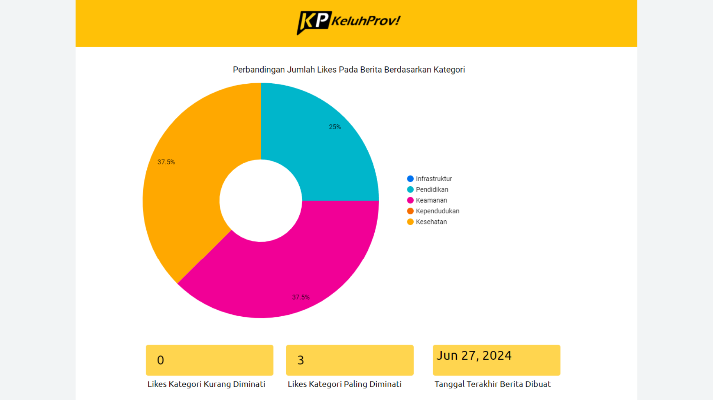
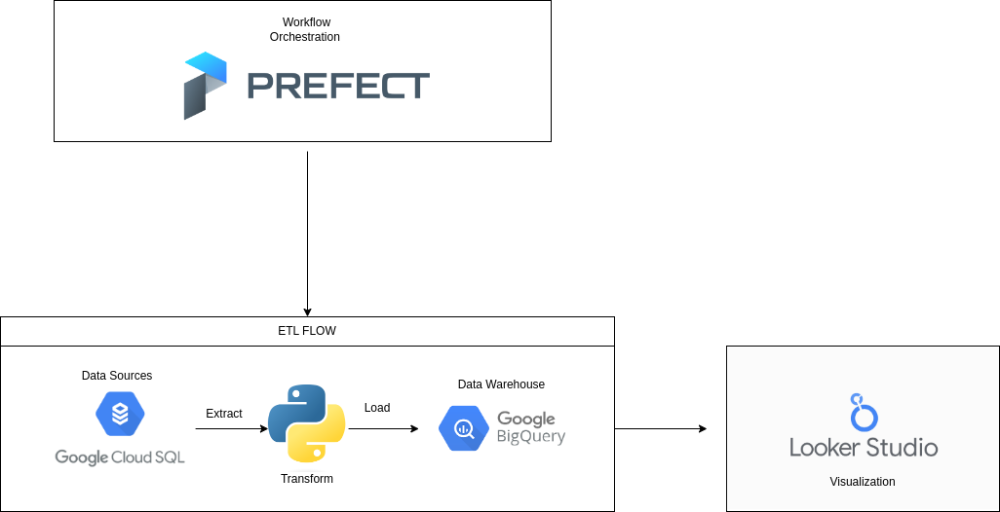

# Data Engineer Team Members
| Name | University | Contact |
|------|------------|---------|
| Muhammad Raihan Saputra | Universitas Dinamika Bangsa | https://www.linkedin.com/in/rhnsaputra |
| Adinda Putri Budi Saraswati | Universitas Pembangunan Nasional "Veteran" Jawa Timur | https://www.linkedin.com/in/adinda-putri-budi-saraswati/ |

 

# Introduction
KeluhProv is an application that can be used by the people of Banten to convey their complaints.  In the development of this project, the data engineer team plays a role in managing and integrating public complaint data to ensure the information is presented accurately. As well as designing analysis dashboards to provide informative visualizations of complaint trends and settlement progress to relevant parties. With this, we are working to improve the government's responsiveness in responding to issues reported by the public.

 

# Tech Stack
Tech stack used by data engineer team for ETL development and visualization:

- Visual Studio Code
- Jupyter Notebook
- Google Big Query
- Google Looker Studio
- GitHub
- Prefect
- PythonAnywhere
- Flask
- Python

 

# OLAP Database Schema

This is OLAP Database Schema for Data Warehouse, this is the place where all data analysis to generate bussiness insights lie here. This schema contains facts table for analyzing like complaint_facts and news_facts where this two facts table will provide insights through visualization like graph and etc. that you can see below :

 

# High Level Architecture (HLA)

This diagram represents a high-level architecture (HLA) for a data pipeline using Prefect for workflow orchestration, Python for data transformation, Google Cloud SQL as the data source, Google BigQuery as the data warehouse, and Looker Studio for visualization.

1. Workflow Orchestration: Prefect

    - Prefect: Prefect is used to orchestrate the entire ETL (Extract, Transform, Load) process. It schedules, monitors, and manages the workflow, ensuring that each step is executed in the correct sequence and handles any errors or retries as needed.

2. ETL Flow

    - Data Sources: Google Cloud SQL
        + Extract: Data is extracted from Google Cloud SQL, which serves as the source database. This could include various types of data such as transactional data, user data, etc.
    - Transform: Python
        + Transform: Once extracted, the data is transformed using Python. This transformation process can involve cleaning, normalizing, aggregating, or enriching the data to fit the desired format for analysis.
    - Data Warehouse: Google BigQuery
        + Load: The transformed data is then loaded into Google BigQuery, which serves as the data warehouse. BigQuery is a fully-managed, serverless, highly scalable, and cost-effective multi-cloud data warehouse designed for business agility.

3. Visualization: Looker Studio

    - Looker Studio: Finally, the data stored in BigQuery is visualized using Looker Studio. Looker Studio allows for the creation of interactive dashboards and reports, providing insights and facilitating data-driven decision-making.
    
# Important Link
- Dashboard Analysis: https://lookerstudio.google.com/reporting/601e88b0-501a-4acd-a4d4-38b345b06258
- Recommendation System: https://altale12.pythonanywhere.com/
